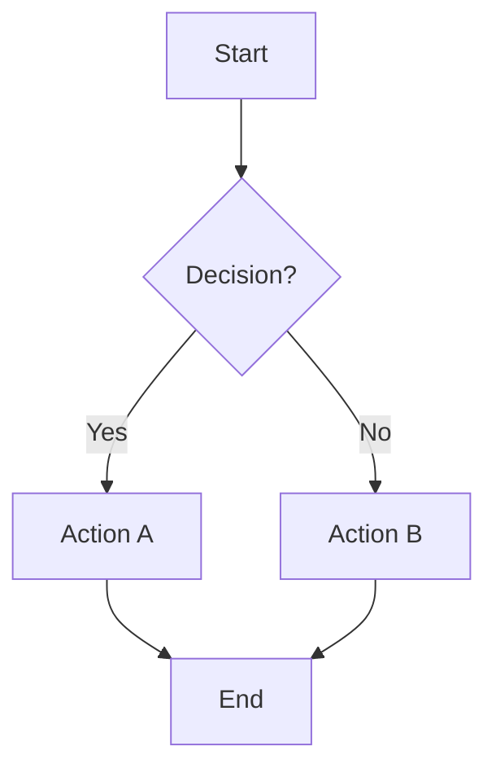
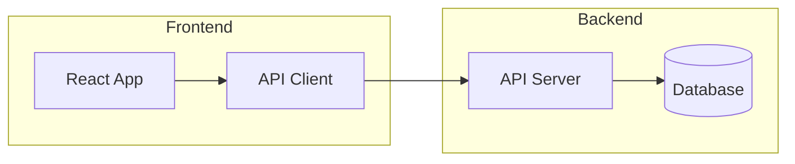
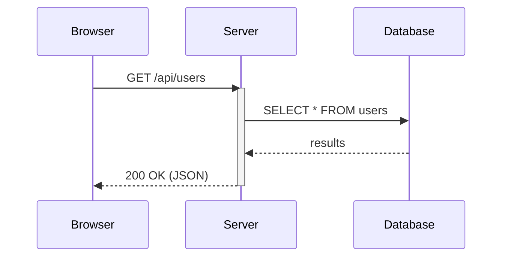
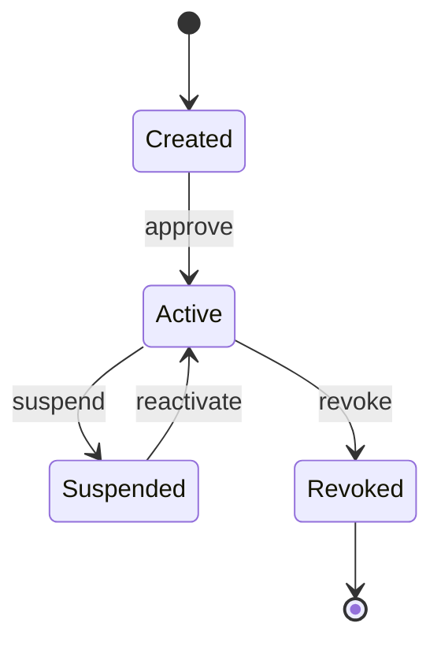
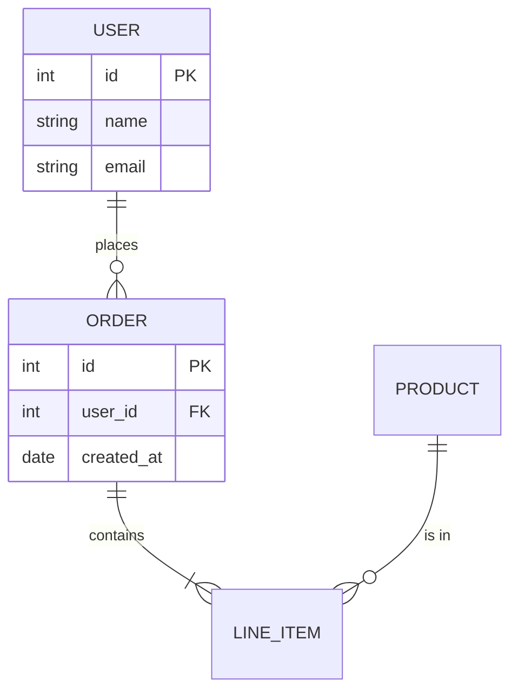
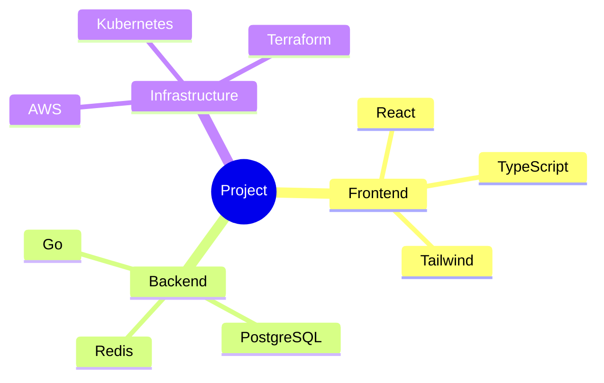
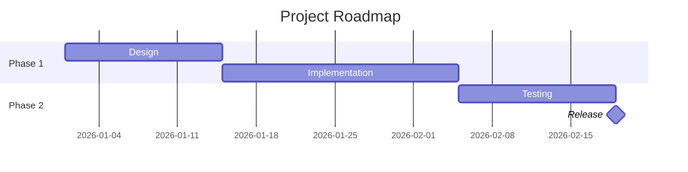
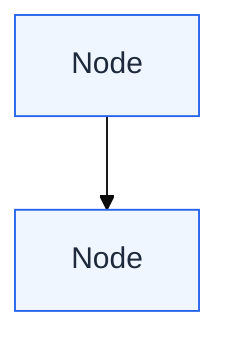

# Mermaid Diagram Skill

Generate diagrams using Mermaid's Markdown-inspired syntax. Mermaid is the most token-efficient and LLM-reliable diagram format, with native rendering in GitHub, GitLab, Obsidian, Notion, and many documentation platforms.

**When to use Mermaid:**
- User explicitly asks for Mermaid format
- User wants inline-editable text diagrams in version control
- User wants to convert an existing SVG/diagram to a simpler text format
- Mermaid-specific types like Gantt, Sankey, or git graphs

**When another format is better:**
- Maximum visual quality and custom design (SVG)
- Informal whiteboard/sketch aesthetic (Excalidraw)
- Threat models, comparisons, Venn diagrams (SVG -- Mermaid lacks these types)
- Complex architecture with nested containers (D2)

Consult the **design-system** skill for color, composition, and quality rules.

## Supported Diagram Types

| Type | Syntax Keyword | Best For |
|---|---|---|
| Flowchart | `flowchart TD` or `flowchart LR` | Process flows, decision trees, pipelines |
| Sequence | `sequenceDiagram` | API calls, request lifecycles, protocols |
| Class | `classDiagram` | OOP design, domain models |
| State | `stateDiagram-v2` | Object lifecycles, state machines |
| ER Diagram | `erDiagram` | Database schemas, data models |
| Gantt | `gantt` | Project timelines, schedules |
| Mind Map | `mindmap` | Topic hierarchies, brainstorming |
| Timeline | `timeline` | Chronological events |
| Sankey | `sankey-beta` | Volume/flow distribution |
| Pie | `pie` | Simple proportions |
| Git Graph | `gitGraph` | Branch/merge visualization |
| C4 Context | `C4Context` | System context diagrams |

## Syntax Quick Reference

### Flowchart


Direction: `TD` (top-down), `LR` (left-right), `BT` (bottom-top), `RL` (right-left).

Node shapes:
- `[text]` -- rectangle
- `(text)` -- rounded rectangle
- `{text}` -- diamond (decision)
- `([text])` -- stadium/pill
- `[[text]]` -- subroutine
- `[(text)]` -- cylinder (database)
- `((text))` -- circle

Subgraphs for grouping:


### Sequence Diagram


Arrow types:
- `->>` solid with arrowhead
- `-->>` dashed with arrowhead
- `-x` solid with cross
- `-)` solid with open arrow (async)

### State Diagram


### ER Diagram


### Mind Map


### Gantt Chart


## Styling

Mermaid supports limited theming. Use `%%{init: {...}}%%` directives:



Available themes: `default`, `dark`, `forest`, `neutral`, `base` (customizable).

For most cases, use `default` or `neutral` theme -- they render well across platforms.

## Common Mistakes to Avoid

1. **Special characters in labels** -- wrap in quotes: `A["Label with (parens)"]`
2. **Semicolons in labels** -- use `#semi;` entity
3. **Long labels** -- Mermaid auto-wraps but results can be ugly. Keep labels under 30 characters.
4. **Too many nodes** -- Mermaid's auto-layout struggles above 20-25 nodes. Split into subgraphs or multiple diagrams.
5. **Complex styling inline** -- Mermaid is not SVG. Accept its styling limitations rather than fighting them.
6. **Mixing arrow styles** -- be consistent: `->>` for all requests, `-->>` for all responses.
7. **Forgetting `v2`** -- use `stateDiagram-v2` not `stateDiagram` for modern features.

## Output Format

Write Mermaid diagrams in fenced code blocks:

````markdown

````

If saving to a file, use `.mmd` extension for standalone Mermaid files.

## Rendering

| Platform | Native Support |
|---|---|
| GitHub (README, issues, PRs) | Yes |
| GitLab (markdown) | Yes |
| Obsidian | Yes |
| Notion | Yes |
| VS Code (with extension) | Yes |
| Docusaurus | Yes (plugin) |
| Confluence | Via Mermaid plugin |

For offline rendering: `npx @mermaid-js/mermaid-cli mmdc -i diagram.mmd -o diagram.svg`

## Quality Checklist

Before presenting a Mermaid diagram:

- [ ] Correct diagram type keyword (`flowchart`, `sequenceDiagram`, etc.)
- [ ] Labels are concise (under 30 characters)
- [ ] Node count is under 25 (split if more)
- [ ] Consistent arrow styles for same relationship types
- [ ] Subgraphs used for logical grouping when 3+ related nodes exist
- [ ] Direction (TD/LR) matches the natural flow of the content
- [ ] Special characters properly escaped or quoted
